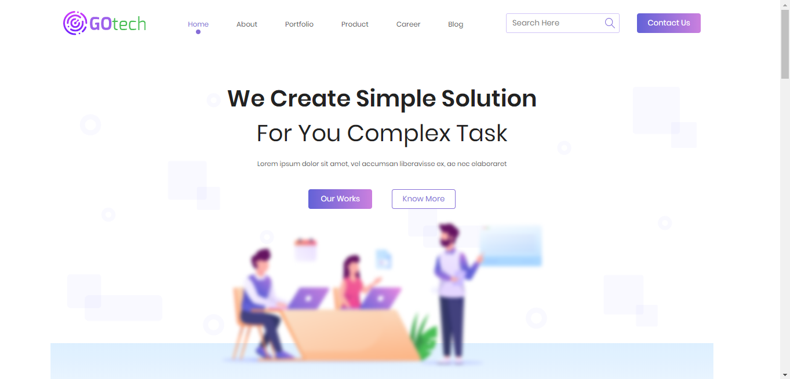

  
  
  <h3> 🚀 Front-end do website GOtech</h3>

  <a href="#project">Projeto</a>&nbsp;&nbsp;&nbsp;|&nbsp;&nbsp;&nbsp;
  <a href="#img">Imagens</a>&nbsp;&nbsp;&nbsp;|&nbsp;&nbsp;&nbsp;
  <a href="#techs">Tecnologias</a>

 

<h2 id="project"> 📌  Projeto </h2>

Projeto de site institucional [GOtech](https://github.com/LorraneAlkimim/GOtech). Front-end desenvolvido com base em um protótipo feito no Adobe XD.

 

<h2 id="img"> 📷  Imagens </h2>

&nbsp;

&nbsp;

&nbsp;

<h2 id="techs"> 💻  Tecnologias </h2>
Esse projeto foi desenvolvido com as seguintes tecnologias:

- HTML
- CSS

